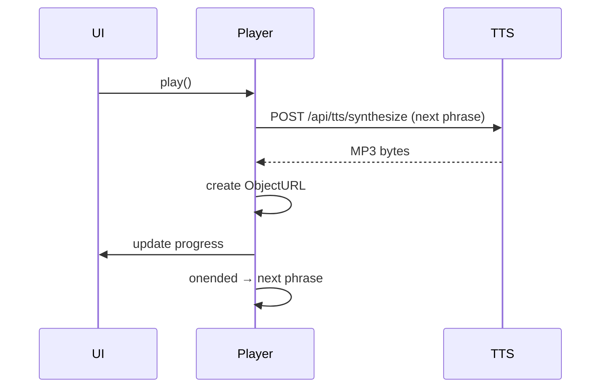

# AudioPlayer

## Funcionamento
- Cria um `HTMLAudioElement` por frase.
- Mantém uma fila de frases a serem reproduzidas.
- Enquanto a frase atual está tocando, a próxima frase é **prefetch** via `POST /api/tts/synthesize`.
- O áudio recebido (MP3) é convertido para `ObjectURL` e associado à frase.

## Estratégia de cache
- Cache em memória de até duas frases adiante.
- Cada cache entry tem um timeout de 45 s; falhas de download são **retry** até 2 vezes (back‑off 400 ms).

## Eventos
- `onplay`, `onpause`, `onended` – avançam ou retrocedem a fila.
- `onerror` – registra falha e pula para a próxima frase.

## Gerenciamento de memória
- Object URLs são revogados (`URL.revokeObjectURL`) assim que a frase sai da fila.
- Quando a fila está vazia, o `AudioElement` é desconectado.

## Estado da player
| Estado | Descrição |
|--------|-----------|
| idle | Nenhuma frase carregada |
| playing | Reproduzindo frase atual |
| paused | Pausado na frase atual |
| error | Falha ao carregar áudio – será pulado |

## Diagrama de fluxo (Mermaid)

