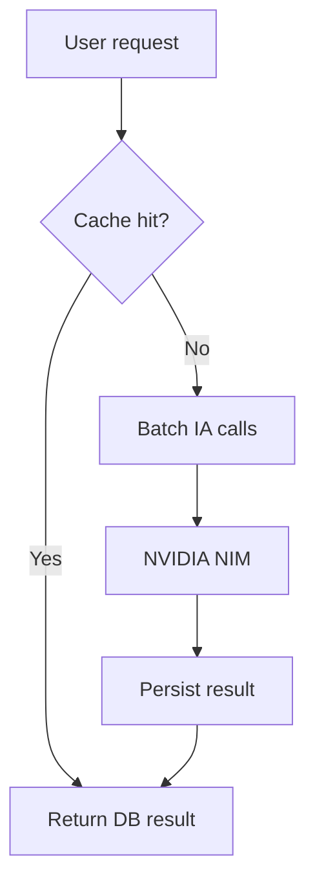

# Performance

## Gargalos conhecidos
- **TTS latency** – chamada ao Edge TTS pode demorar até 2 s; prefetch reduz impacto.
- **Batch IA** – extração de personagens/knowledge processa múltiplas chamadas sequenciais; `batchProcess` paraleliza até o limite de taxa.
- **Memory usage** – áudio em memória (Object URLs) pode acumular se o usuário navega rapidamente sem liberar.

## Otimizações atuais
- Prefetch da próxima frase no `AudioPlayer`.
- Cache de IA em DB, evitando chamadas repetidas.
- Retry + back‑off para chamadas de rede.

## Recomendações
- Aumentar o limite de concorrência em `batchProcess` quando a cota de NVIDIA permitir.
- Implementar streaming direto do TTS para o cliente (WebSocket) para reduzir memória temporária.
- Adicionar métricas de tempo de resposta (ex.: `prom-client`) para monitorar latência.

## Concurrency
- Backend usa Node.js async/await; rotas são independentes.
- `batchProcess` garante que não mais que **X** (default 5) chamadas concorrentes ocorram.

## Diagram (Mermaid)

