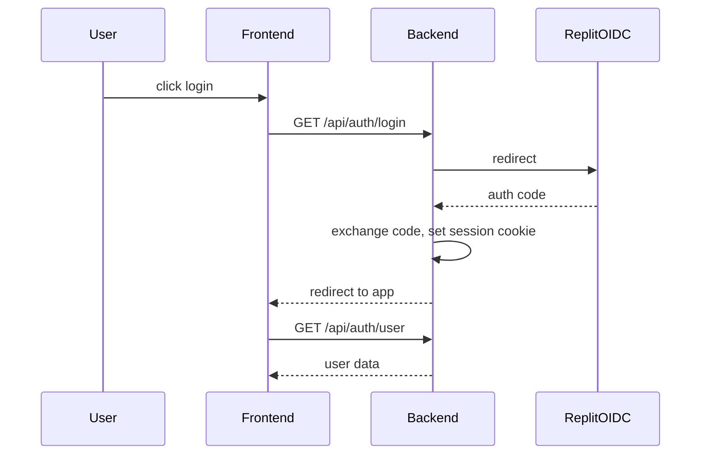

# Security

## Autenticação & Sessão (Auth/Session)
- Utiliza **Replit OIDC** (`openid-client`) para login único.
- Sessões são geridas por `express-session` com `SESSION_SECRET`.
- Cookies são `httpOnly`, `secure` (em produção) e contêm apenas o ID da sessão.
- Endpoints:
  - `GET /api/auth/login` – redireciona ao provedor OIDC.
  - `GET /api/auth/logout` – destrói a sessão.
  - `GET /api/auth/user` – devolve informações do usuário autenticado.

## Controle de acesso
- Rotas sensíveis (ex.: `/api/books/*`) requerem middleware `ensureAuthenticated`.
- Não há autorização baseada em papéis, pois a aplicação é single‑user.

## Segredos
- `AI_INTEGRATIONS_OPENAI_API_KEY` – chave da NVIDIA NIM (armazenada em `.env`).
- `SESSION_SECRET` – gerado via `openssl rand -hex 32`.

## Rate‑limit (pendente)
- Planejado middleware usando `batch/utils.isRateLimitError` para responder com cabeçalhos `Retry-After`.

## Segurança de IA/TTS
- Todos os dados enviados ao NVIDIA NIM são texto sem informações sensíveis; o cliente sanitiza antes da chamada.

## Segurança de Dados
- PostgreSQL não expõe diretamente; conexão via `DATABASE_URL` em `.env`.
- Todos os campos são validados com Zod schemas (via `lib/api-zod`).

## Diagrama de fluxo de autenticação

