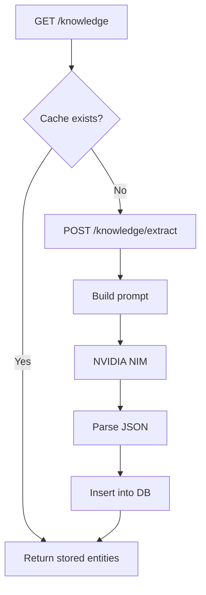

# World Extraction

## Objetivo
Gerar uma base de conhecimento estruturada (personagens, organizações, facções, locais, habilidades, artefatos, eventos) a partir dos capítulos do livro.

## Fluxo
1. **GET** `/api/books/:id/knowledge` – retorna entidades já extraídas.
2. **POST** `/api/books/:id/knowledge/extract`
   - Constrói um “budget” de texto: capítulos 1‑25 → 700 chars cada; capítulos 26‑50 → 350 chars cada.
   - Prompt descreve “analista de world‑building” e solicita JSON com arrays por tipo de entidade.
3. **Parsing** – regex para extrair objeto JSON, normaliza campos.
4. **Persistência** – insere em `book_knowledge` (coluna `entityType` enum).

## Atualização incremental
- Cada extração armazena `firstAppearanceChapter` e `lastMentionedChapter`.
- Nova chamada só processa capítulos ainda não analisados (marca `lastExtractedChapter` interno – futuro melhoria).

## Uso da AI
- Todas as chamadas são feitas ao **NVIDIA NIM** (`gpt‑4o‑mini`) através do cliente OpenAI‑compatible.

## Diagrama (Mermaid)

